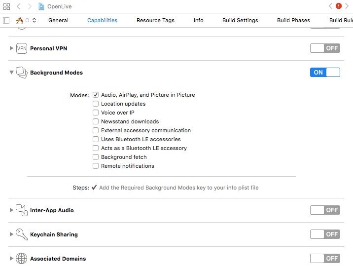
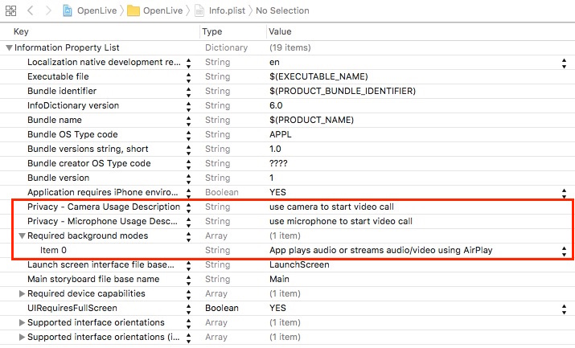
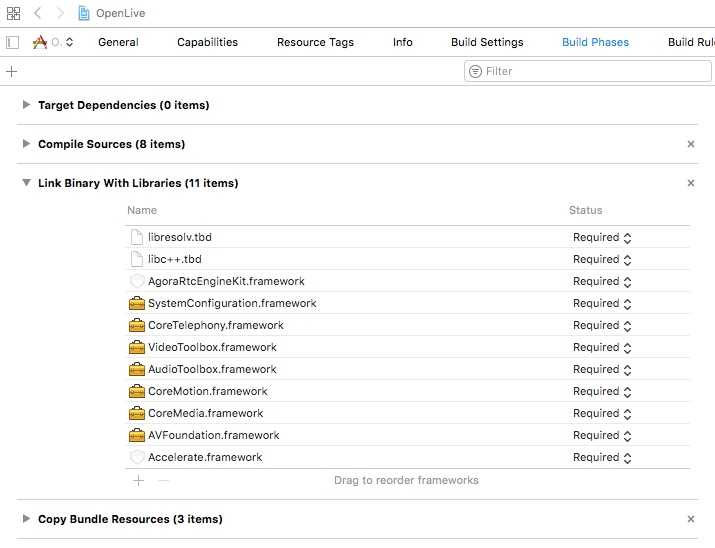
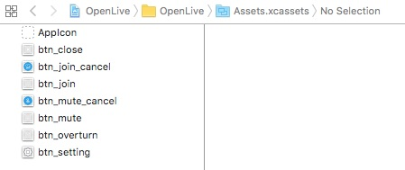
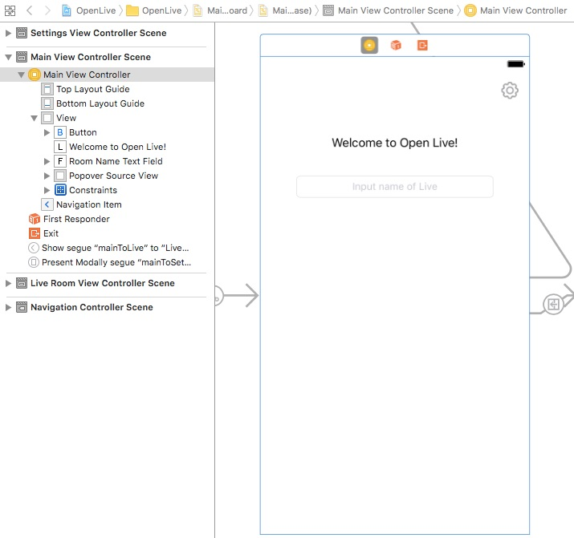
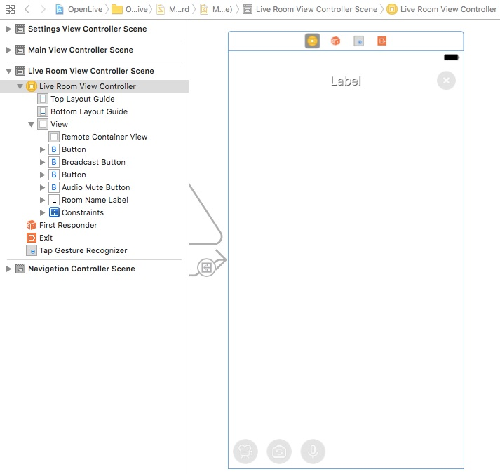
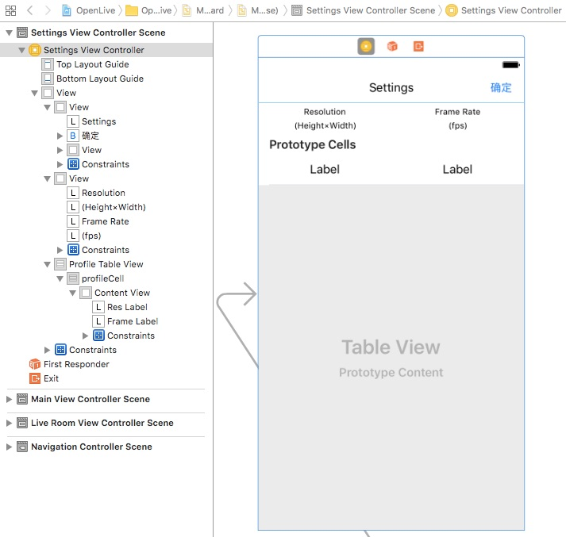

# Open Live iOS for Swift

This tutorial describes how to add live video chat to your iOS applications using Swift and the Agora Video SDK.

With this sample app, you can:

- [Join](#create-the-loadagorakit-method) / [leave](#create-the-leavechannel-method) a channel
- [Set user role as a broadcaster or audience member](#create-the-mainviewcontroller-extensions)
- [Mute/unmute audio](#define-private-variables)
- [Switch camera views](#create-the-doswitchcamerapressed-ibaction-method)
- [Set up the resolution, the frame rate, and the bit rate display](#create-the-loadagorakit-method)

## Prerequisites
- Xcode 8.0+
- Physical iOS device (iPhone or iPad)
	
	**Note:** Use a physical device to run the sample. Some simulators lack the functionality or the performance needed to run the sample.

## Quick Start

This section shows you how to prepare, build, and run the sample application.

- [Create an Account and Obtain an App ID](#create-an-account-and-obtain-an-app-id)
- [Update and Run the Sample Application](#update-and-run-the-sample-application) 


### Create an Account and Obtain an App ID
To build and run the sample application, you must obtain an app ID: 

1. Create a developer account at [agora.io](https://dashboard.agora.io/signin/). Once you finish the sign-up process, you are redirected to the dashboard.
2. Navigate in the dashboard tree on the left to **Projects** > **Project List**.
3. Copy the app ID that you obtained from the dashboard into a text file. You will use this when you launch the app.


### Update and Run the Sample Application 

1. Open `OpenLive.xcodeproj` and edit the `KeyCenter.swift` file. In the `agoraKit` declaration, update `<#Your App Id#>` with your app ID.

	``` Swift
    static let AppId: String = <#Your App Id#>
	```

2. Download the [Agora Video SDK](https://www.agora.io/en/download/). Unzip the downloaded SDK package and copy the `libs/AograRtcEngineKit.framework` file from the SDK folder into the sample application's `OpenLive` folder.
			
3. Connect your iPhone or iPad device and run the project. Ensure a valid provisioning profile is applied or your project will not run.

## Steps to Create the Sample 

- [Set Permissions and Add Frameworks and Libraries](#set-permissions-and-add-frameworks-and-libraries)
- [Design the User Interface](#design-the-user-interface)
- [Create the MainViewController Class](#create-the-mainviewcontroller-class)
- [Create the MainViewController Class Delegates](#create-mainviewcontroller-delegates)
- [Create the RoomViewController](#create-the-roomviewcontroller)
- [Create RoomViewController Agora Methods and Delegates](#create-roomviewcontroller-agora-methods-and-delegates)
- [Create the ChatMessageViewController](#create-the-chatmessageviewcontroller)
- [Create the SettingsViewController](#create-the-settingsviewcontroller)


### Set Permissions and Add Frameworks and Libraries

Under the **Capabilities** tab, enable **Audio, AirPlay, and Picture in Picture** mode.



Open the `info.plist` file. Enable the camera and microphone privacy settings for the application. Ensure background mode enables AirPlay to play audio/video.



Under the **Build Phases** tab, add the following frameworks and libraries to your project:

- `libresolv.tbd`
- `libc++.tbd`
- `AgoraRtcEngineKit.framework`
- `SystemConfiguration.framework`
- `CoreTelephony.framework`
- `VideoToolbox.framework`
- `AudioToolbox.framework`
- `CoreMotion.framework`
- `CoreMedia.framework`
- `AVFoundation.framework`
- `Accelerate.framework`



### Design the User Interface

- [Add Assets](#add-assets)
- [Create the MainViewController UI](#create-the-mainviewcontroller-ui)
- [Create the LiveRoomViewController UI](#create-the-roomviewcontroller-ui)
- [Create the SettingsViewController UI](#create-the-settingsviewcontroller-ui)


#### Add Assets

Add the following assets to `Assets.xcassets`.

**Note:** Use Xcode to import assets to `Assets.xcassets`. PDF files are used for these assets, which contain images for each iOS screen resolution.



Asset|Description
------|------
`btn_close`|An image of an **X** to close a window|
`btn_join` and `btn_join_cancel`|Images of a camera to join / leave a call
`btn_mute` and `btn_mute_cancel`|Images of a microphone to mute/unmute audio
`btn_overturn`|An image of a camera and rotational arrows to switch between the two cameras
`btn_setting`|An image of a cog to open the settings window


#### Create the MainViewController UI

Create the layout for the `MainViewController`.

**Note:** This layout includes a navigation `segue` to move from screen to screen.



#### Create the LiveRoomViewController UI

Create the layout for the `LiveRoomViewController`.

**Note:** The `LiveRoomViewController` layout includes tap recognizer for handling user interaction.




#### Create the SettingsViewController UI

Create the layout for the `SettingsViewController`.




### Create the MainViewController Class

*MainViewController.swift* defines and connects application functionality with the [MainViewController UI](#create-the-mainviewcontroller-ui).

- [Define Global Variables](#define-global-variables)
- [Override the prepare() Segue Method](#override-the-prepare-segue-method)
- [Create the MainViewController Extensions](#create-the-mainviewcontroller-extensions)
- [Create MainViewController Delegates](#create-the-mainviewcontroller-delegates)

#### Define Global Variables

The `MainViewController` class has three `IBOutlet` variables. These map to the [MainViewController UI](#create-the-mainviewcontroller-ui) elements.

Variable|Description
----|----
`roomNameTextField`|Maps to the `UITextField` in the `MainViewController` layout
`popoverSourceView`|Maps to the placeholder `UIView` in the `MainViewController` layout

``` Swift
import UIKit
import AgoraRtcEngineKit

class MainViewController: UIViewController {
    
    @IBOutlet weak var roomNameTextField: UITextField!
    @IBOutlet weak var popoverSourceView: UIView!
    
    ...
}
```

The `MainViewController` class has one private variable. The `videoProfile` variable is initialized with the Agora 640 x 360 video profile using `AgoraVideoDimension640x360`.

``` Swift    
    fileprivate var videoProfile = AgoraVideoDimension640x360
```

#### Override the prepare() Segue Method

Override the `prepare()` segue method to manage the application navigation. 

If the `segueId` is `mainToSettings`, prepare the settings view through the segue destination `SettingsViewController`:

- Set `settingsVC.videoProfile` to the current `videoProfile`.
- Set `settingsVC.delegate` to `self`.

If the `segueId` is `mainToLive`, prepare the room view through the segue destination `LiveRoomViewController`:

- Set `roomVC.roomName` to `roomNameTextField.text`.
- Set `roomVC.videoProfile ` to the current `videoProfile`.
- Set `liveVC.clientRole` to `role`. `role` is retrieved by converting `sender` into an `AgoraClientRole`.
- Set `roomVC.delegate` to `self`.

``` Swift    
    override func prepare(for segue: UIStoryboardSegue, sender: Any?) {
        guard let segueId = segue.identifier else {
            return
        }
        
        switch segueId {
        case "mainToSettings":
            let settingsVC = segue.destination as! SettingsViewController
            settingsVC.videoProfile = videoProfile
            settingsVC.delegate = self
        case "mainToLive":
            let liveVC = segue.destination as! LiveRoomViewController
            liveVC.roomName = roomNameTextField.text!
            liveVC.videoProfile = videoProfile
            if let value = sender as? NSNumber, let role = AgoraClientRole(rawValue: value.intValue) {
                liveVC.clientRole = role
            }
            liveVC.delegate = self
        default:
            break
        }
    }
```

#### Create the MainViewController Extensions

The `showRoleSelection()` method is an extension method to display the role selection window.

Create a `UIAlertController` object and three `UIAlertAction` objects `broadcaster`, `audience`, and `cancel`.

Apply the three `UIAlertAction` objects to `sheet` using `addAction()` and set the following properties for `sheet.popoverPresentationController?`:

- `sourceView` as `popoverSourceView`, which is the placeholder `UIView` created in [MainViewController UI](#create-the-mainviewcontroller-ui).
- `permittedArrowDirections` as `.up` to indicate the window should animate from the bottom to the top of the screen.

Display `sheet` using the `present()` method. The window will automatically listen for the following user actions.

- If the user chooses the `broadcaster` action, invoke `self?.join()` with the broadcaster role.
- If the user chooses the `audience` action, invoke `self?.join()` with the audience member role.
- If the user chooses the `cancel` action, close the role chooser window.

```
private extension MainViewController {
    func showRoleSelection() {
        let sheet = UIAlertController(title: nil, message: nil, preferredStyle: .actionSheet)
        let broadcaster = UIAlertAction(title: "Broadcaster", style: .default) { [weak self] _ in
            self?.join(withRole: .broadcaster)
        }
        let audience = UIAlertAction(title: "Audience", style: .default) { [weak self] _ in
            self?.join(withRole: .audience)
        }
        let cancel = UIAlertAction(title: "Cancel", style: .cancel, handler: nil)
        sheet.addAction(broadcaster)
        sheet.addAction(audience)
        sheet.addAction(cancel)
        sheet.popoverPresentationController?.sourceView = popoverSourceView
        sheet.popoverPresentationController?.permittedArrowDirections = .up
        present(sheet, animated: true, completion: nil)
    }
}
```

The `join()` method is an extension method to begin joining the channel with a specific `role`.

This method navigates from the main screen to the room screen using the `performSegue()` method.

``` Swift
private extension MainViewController {
    func join(withRole role: AgoraClientRole) {
        performSegue(withIdentifier: "mainToLive", sender: NSNumber(value: role.rawValue as Int))
    }
}
```

#### Create the MainViewController Delegates

The `settingsVC()` method is a delegate method for the `SettingsViewController`. This method is invoked when the video profile for the `SettingsViewController` changes. It updates the `videoProfile`, and dismisses the view using `dismiss()`.

``` Swift
extension MainViewController: SettingsVCDelegate {
    func settingsVC(_ settingsVC: SettingsViewController, didSelectProfile profile: CGSize) {
        videoProfile = profile
        dismiss(animated: true, completion: nil)
    }
}
```

The `liveVCNeedClose()` method is a delegate method for the `LiveRoomVCDelegate`. This method is invoked when the user leaves the room, and reviews the view using `navigationController?.popViewController()`.

``` Swift
extension MainViewController: LiveRoomVCDelegate {
    func liveVCNeedClose(_ liveVC: LiveRoomViewController) {
        let _ = navigationController?.popViewController(animated: true)
    }
}
```

The `textFieldShouldReturn()` method is a delegate method for the `UITextField` objects in `MainViewController`. This method is invoked when the user presses the keyboard return.

If the current text field is `textField` and the field is not empty, show the role selection UI using `showRoleSelection()`.

``` Swift
extension MainViewController: UITextFieldDelegate {
    func textFieldShouldReturn(_ textField: UITextField) -> Bool {
        if let string = textField.text , !string.isEmpty {
            showRoleSelection()
        }
        
        return true
    }
}
```

### Create the LiveRoomViewController

*LiveRoomViewController.swift* defines and connects application functionality with the [LiveRoomViewController UI](#create-the-liveroomviewcontroller-ui).

- [Define the LiveRoomVCDelegate Protocol and IBOutlet Variables](#define-the-liveroomvcdelegate-protocol-and-iboutlet-variables)
- [Define Public Variables](#define-public-variables)
- [Define Private Variables](#define-private-variables)
- [Create Superclass and IBAction Methods](#create-superclass-and-ibaction-methods)
- [Create Private User Interface Methods](#create-private-user-interface-methods)
- [Create Private Interface Update and Session Methods](#create-private-interface-update-and-session-methods)

#### Define the LiveRoomVCDelegate Protocol and IBOutlet Variables

The `liveVCNeedClose()` method is used for communication between the `LiveRoomViewController` class and its delegate. The method informs the delegate to close the room.

``` Swift
import UIKit
import AgoraRtcEngineKit

protocol LiveRoomVCDelegate: NSObjectProtocol {
    func liveVCNeedClose(_ liveVC: LiveRoomViewController)
}
```

The `LiveRoomViewController` class contains `IBOutlet` variables to manage buttons, view containers, and handle other UI elements. The variables map to the [LiveRoomViewController UI](#create-the-liveroomviewcontroller-ui) elements.

Variable|Description
----|----
`roomNameLabel`|Label for the room name in the header of the layout
`remoteContainerView`|Container for the videos in the room
`broadcastButton`|Button for broadcasting
`sessionButtons`|Array of buttons for session management
`audioMuteButton`|Button to mute/unmute the audio

``` Swift
class LiveRoomViewController: UIViewController {
    
    @IBOutlet weak var roomNameLabel: UILabel!
    @IBOutlet weak var remoteContainerView: UIView!
    @IBOutlet weak var broadcastButton: UIButton!
    @IBOutlet var sessionButtons: [UIButton]!
    @IBOutlet weak var audioMuteButton: UIButton!
    
    ...
}
```

#### Define Public Variables

The `LiveRoomViewController` class has six public variables. These variables manage the `LiveRoomViewController` settings.

Variable|Description
----|----
`roomName`|The name of the room
`clientRole`|The role of the user. Default value is set to audience member. When this variable is set, it invokes the `updateButtonsVisiablity()` method.
`videoProfile`|The video profile for the room
`delegate`|The delegate for the `LiveRoomViewController` class
`AgoraRtcEngineKit`|The Agora RTC Engine SDK object


``` Swift
    var roomName: String!
    var clientRole = AgoraClientRole.audience {
        didSet {
            updateButtonsVisiablity()
        }
    }
    var videoProfile: CGSize!
    weak var delegate: LiveRoomVCDelegate?
    
    //MARK: - engine & session view
    var rtcEngine: AgoraRtcEngineKit!
```

#### Define Private Variables

The `LiveRoomViewController` class has five private variables. These variables manage the `LiveRoomViewController` settings.

The `isBroadcaster` variable indicates if the user is a broadcaster or not.

``` Swift    
    fileprivate var isBroadcaster: Bool {
        return clientRole == .broadcaster
    }
```

The `isMuted` variable indicates if the user is a muted or not. Initialized to a value of `false`. When this variable is set, the `rtcEngine?.muteLocalAudioStream()` method is invoked and the mute button image is updated using `setImage()`.

``` Swift    
    fileprivate var isMuted = false {
        didSet {
            rtcEngine?.muteLocalAudioStream(isMuted)
            audioMuteButton?.setImage(UIImage(named: isMuted ? "btn_mute_cancel" : "btn_mute"), for: .normal)
        }
    }
```

The `videoSessions` variable is an srray of video sessions for the connected users. Initialized with an empty array of `VideoSession` objects. When this variable is set, the `updateInterface()` method is invoked if `remoteContainerView` is not `nil`.

``` Swift    
    fileprivate var videoSessions = [VideoSession]() {
        didSet {
            guard remoteContainerView != nil else {
                return
            }
            updateInterface(withAnimation: true)
        }
    }
```

The `fullSession` variable is the video session for the full view video. When this variable is set, the `updateInterface()` method is invoked if the value has changed and `remoteContainerView` is not `nil`.

``` Swift    
    fileprivate var fullSession: VideoSession? {
        didSet {
            if fullSession != oldValue && remoteContainerView != nil {
                updateInterface(withAnimation: true)
            }
        }
    }
```

The `viewLayouter` variable is a `VideoViewLayouter` object for handling the layout for the videos.

``` Swift    
    fileprivate let viewLayouter = VideoViewLayouter()
```


#### Create Superclass and IBAction Methods

The `viewDidLoad()` method initializes the `LiveRoomViewController`: 

1. Set the `roomNameLabel` text to `roomName`.
3. Update the buttons for the view using `updateButtonsVisiablity()`.
4. Load the Agora RTC engine SDK using `loadAgoraKit()`.

``` Swift    
    override func viewDidLoad() {
        super.viewDidLoad()
        
        roomNameLabel.text = roomName
        updateButtonsVisiablity()
        
        loadAgoraKit()
    }
```

The `IBAction` methods map to the UI elements for the `LiveRoomViewController`.

- [Create the doSwitchCameraPressed() IBAction Method](#create-the-doswitchcamerapressed-ibaction-method)
- [Create the doMutePressed() IBAction Method](#create-the-domutepressed-ibaction-method)
- [Create the doBroadcastPressed() IBAction Method](#create-the-dobroadcastpressed-ibaction-method)
- [Create the doDoubleTapped() IBAction Method](#create-the-dodoubletapped-ibaction-method)
- [Create the doLeavePressed() IBAction Method](#create-the-doleavepressed-ibaction-method)

##### Create the doSwitchCameraPressed() IBAction Method

The `doSwitchCameraPressed()` method is invoked by the camera UI button action and switches the camera view using `rtcEngine?.switchCamera()`.

``` Swift    
    //MARK: - user action
    @IBAction func doSwitchCameraPressed(_ sender: UIButton) {
        rtcEngine?.switchCamera()
    }
```

##### Create the doMutePressed() IBAction Method

The `doMutePressed()` method is invoked by the audio UI button and updates `isMuted`.

``` Swift    
    @IBAction func doMutePressed(_ sender: UIButton) {
        isMuted = !isMuted
    }
```

##### Create the doBroadcastPressed() IBAction Method

The `doBroadcastPressed()` method is invoked by the broadcast UI button.

If the user is a broadcaster set `clientRole` to `.audience` and set `fullSession` to `nil` if `fullSession?.uid` is equal to `0`. Otherwise, set `clientRole` to `.broadcaster`.

Set the new client role using `rtcEngine.setClientRole()` and update the interface using `updateInterface()`.

``` Swift    
    @IBAction func doBroadcastPressed(_ sender: UIButton) {
        if isBroadcaster {
            clientRole = .audience
            if fullSession?.uid == 0 {
                fullSession = nil
            }
        } else {
            clientRole = .broadcaster
        }
        
        rtcEngine.setClientRole(clientRole)
        updateInterface(withAnimation :true)
    }
```

##### Create the doDoubleTapped() IBAction Method

The `doDoubleTapped()` method is invoked by the `UITapGestureRecognizer` gesture recognizer created in the storyboard.

- If `fullSession` is `nil`, detect the video session using `viewLayouter.responseSession()`, and set `fullSession` to the selected video session.
- If `fullSession` already exists, set `fullSession` to nil.

``` Swift    
    @IBAction func doDoubleTapped(_ sender: UITapGestureRecognizer) {
        if fullSession == nil {
            if let tappedSession = viewLayouter.responseSession(of: sender, inSessions: videoSessions, inContainerView: remoteContainerView) {
                fullSession = tappedSession
            }
        } else {
            fullSession = nil
        }
    }
```

##### Create the doLeavePressed() IBAction Method

The `doLeavePressed()` method is invoked by the close UI button action and invokes the `leaveChannel()` method.

``` Swift    
    @IBAction func doLeavePressed(_ sender: UIButton) {
        leaveChannel()
    }
```

#### Create Private User Interface Methods

The private user interface methods for the `LiveRoomViewController` are created as functions in a private extension.

``` Swift
private extension RoomViewController {
	...
}
```

- [Create the updateSelfViewVisiable() Method](#create-the-updateselfviewvisiable-method)
- [Create the leaveChannel() Method](#create-the-leavechannel-method)
- [Create the setIdleTimerActive() Method](#create-the-setIdleTimerActive-method)
- [Create the alert() Method](#create-the-alert-method)


##### Create the updateSelfViewVisiable() Method

The `updateSelfViewVisiable()` method sets the session buttons to hidden/not hidden.

Update the image for `broadcastButton` using `setImage()`

For each `button` in `sessionButtons`, show the button if the user is a broadcaster, otherwise show the button.

``` Swift
private extension LiveRoomViewController {
    func updateButtonsVisiablity() {
        guard let sessionButtons = sessionButtons else {
            return
        }
        
        broadcastButton?.setImage(UIImage(named: isBroadcaster ? "btn_join_cancel" : "btn_join"), for: UIControlState())
        
        for button in sessionButtons {
            button.isHidden = !isBroadcaster
        }
    }
```

##### Create the leaveChannel() Method

The `leaveChannel()` method enables the user to leave the video session.

1. Set the idle timer to active using `setIdleTimerActive()`.
2. Clear the local video and leave the channel by applying `nil` as the parameter for `agoraKit.setupLocalVideo()` and `agoraKit.leaveChannel()`.
3. If the user is a broadcaster, stop the video preview using `rtcEngine.stopPreview()`.
4. Loop through `videoSessions` and remove its `hostingView` from the superview using `removeFromSuperview()`. 
5. Clear the video sessions array using `videoSessions.removeAll()`.
6. Complete the method by invoking the room to close using `delegate?.roomVCNeedClose()`.


``` Swift
    func leaveChannel() {
        setIdleTimerActive(true)
        
        rtcEngine.setupLocalVideo(nil)
        rtcEngine.leaveChannel(nil)
        if isBroadcaster {
            rtcEngine.stopPreview()
        }
        
        for session in videoSessions {
            session.hostingView.removeFromSuperview()
        }
        videoSessions.removeAll()
        
        delegate?.liveVCNeedClose(self)
    }
```

##### Create the setIdleTimerActive() Method

The `setIdleTimerActive()` method updates the idle timer of the sample application to be either active or inactive using `UIApplication.shared.isIdleTimerDisabled()`.

``` Swift
    func setIdleTimerActive(_ active: Bool) {
        UIApplication.shared.isIdleTimerDisabled = !active
    }
```

##### Create the alert() Method

The `alert()` method appends an alert message to the chat message box.

Ensure `string` is not empty before creating an `UIAlertController` object with the provided `string` and add an `UIAlertAction` to `alert`.

Display the alert using `present()`.

``` Swift
    func alert(string: String) {
        guard !string.isEmpty else {
            return
        }
        
        let alert = UIAlertController(title: nil, message: string, preferredStyle: .alert)
        alert.addAction(UIAlertAction(title: "Ok", style: .cancel, handler: nil))
        present(alert, animated: true, completion: nil)
    }
}
```

#### Create Private Interface Update and Session Methods

The interface update and session methods are contained within a private extension.

```
private extension LiveRoomViewController {
	...
}
```

- [Create updateInterface() Methods](#create-updateinterface-methods)
- [Create Session Methods](#create-session-methods)

##### Create updateInterface() Methods

The `updateInterface()` methods handle layout updates for the video session.

The `updateInterface()` method with `animation` checks if animation is used for the update, and animates the update within `0.3` seconds using `UIView.animate()`.

``` Swift
    func updateInterface(withAnimation animation: Bool) {
        if animation {
            UIView.animate(withDuration: 0.3, animations: { [weak self] _ in
                self?.updateInterface()
                self?.view.layoutIfNeeded()
            })
        } else {
            updateInterface()
        }
    }
```

The `updateInterface()` method without animation updates the layout for the video views.

- If the user is not a broadcaster and `displaySessions` is empty, remove the first session using `displaySessions.removeFirst()`

- Use `viewLayouter.layout()` to update the layout of `displaySessions`

- Set the stream type for the sessions using `setStreamType()`

``` Swift
    func updateInterface() {
        var displaySessions = videoSessions
        if !isBroadcaster && !displaySessions.isEmpty {
            displaySessions.removeFirst()
        }
        viewLayouter.layout(sessions: displaySessions, fullSession: fullSession, inContainer: remoteContainerView)
        setStreamType(forSessions: displaySessions, fullSession: fullSession)
    }
```

##### Create Session Methods

The `setStreamType()` method sets the stream type for each session.

Set each session's remote video stream type using `rtcEngine.setRemoteVideoStream`. 

- If `fullSession` is valid, and the session is equal to `fullSession`, set the type to `.high`, otherwise set the stream type to `.low`.
- If `fullSession` is not valid, set all session video stream types to `.high`

``` Swift
    func setStreamType(forSessions sessions: [VideoSession], fullSession: VideoSession?) {
        if let fullSession = fullSession {
            for session in sessions {
                rtcEngine.setRemoteVideoStream(UInt(session.uid), type: (session == fullSession ? .high : .low))
            }
        } else {
            for session in sessions {
                rtcEngine.setRemoteVideoStream(UInt(session.uid), type: .high)
            }
        }
    }
```

The `addLocalSession()` method adds a new local session.

Create the session using `VideoSession.localSession()` and appending it to `videoSessions` using `append()`.

Set up the local video for the session using `rtcEngine.setupLocalVideo()`.

``` Swift
    func addLocalSession() {
        let localSession = VideoSession.localSession()
        videoSessions.append(localSession)
        rtcEngine.setupLocalVideo(localSession.canvas)
    }
```

The `fetchSession()` method returns the `VideoSession` for a specified user. Loop through `videoSessions` until the `session.uid` matches the `uid`.

``` Swift
    func fetchSession(ofUid uid: Int64) -> VideoSession? {
        for session in videoSessions {
            if session.uid == uid {
                return session
            }
        }
        
        return nil
    }
```

The `videoSession()` method returns the `VideoSession` for the user. The difference between this method and the `fetchSession()` method is that if no `fetchSession()` exists a new `VideoSession` object is created and appended to `videoSessions`.

``` Swift
    func videoSession(ofUid uid: Int64) -> VideoSession {
        if let fetchedSession = fetchSession(ofUid: uid) {
            return fetchedSession
        } else {
            let newSession = VideoSession(uid: uid)
            videoSessions.append(newSession)
            return newSession
        }
    }
```

### Create LiveRoomViewController Agora Methods and Delegates

The methods for the Agora SDK are placed within extensions for `LiveRoomViewController`.

- [Create the loadAgoraKit Method](#create-the-loadagorakit-method)
- [Create the didJoinedOfUid Event Listener](#create-the-didjoinedofuid-event-listener)
- [Create the firstLocalVideoFrameWith Event Listener](#create-the-firstlocalvideoframewith-event-listener)
- [Create the didOfflineOfUid Event Listener](#create-the-didofflineofuid-event-listener)


#### Create the loadAgoraKit Method

The `loadAgoraKit()` method initializes the Agora RTC engine using `AgoraRtcEngineKit.sharedEngine()`.

Create an `AgoraRtcEngineKit` shared engine object with `KeyCenter.AppId` using `AgoraRtcEngineKit.sharedEngine()`

Apply the following settings for `rtcEngine`:

- Set channel profile to live broadcasting using `rtcEngine.setChannelProfile()`
- Enable dual stream mode using `rtcEngine.enableDualStreamMode()`
- Enable video using `rtcEngine.enableVideo()`
- Set the video encoder configuration using `rtcEngine.setVideoEncoderConfiguration()`

``` Swift
private extension LiveRoomViewController {
    func loadAgoraKit() {
        rtcEngine = AgoraRtcEngineKit.sharedEngine(withAppId: KeyCenter.AppId, delegate: self)
        
        rtcEngine.setChannelProfile(.liveBroadcasting)
        rtcEngine.enableDualStreamMode(true)
        rtcEngine.enableVideo()
        rtcEngine.setVideoEncoderConfiguration(AgoraVideoEncoderConfiguration(size: videoProfile,
                                                                              frameRate: .fps15,
                                                                              bitrate: AgoraVideoBitrateStandard,
                                                                              orientationMode: .adaptative))
        rtcEngine.setClientRole(clientRole)
        
        ...
        
	}
}
```

If the user is a broadcaster, start the preview using `rtcEngine.startPreview()` and invoke `addLocalSession()`

``` Swift
        if isBroadcaster {
            rtcEngine.startPreview()
        }
        
        addLocalSession()
```

Join the channel `roomName` using `rtcEngine.joinChannel()`:

- If the `code` is equal to `0`, the channel join is successful. Disable the idle timer using `setIdleTimerActive` and enable the speakerphone using `rtcEngine.setEnableSpeakerphone()`.

- If the channel join is not successful, display an error message alert using `self.alert()`.


``` Swift
        let code = rtcEngine.joinChannel(byToken: nil, channelId: roomName, info: nil, uid: 0, joinSuccess: nil)
        if code == 0 {
            setIdleTimerActive(false)
            rtcEngine.setEnableSpeakerphone(true)
        } else {
            DispatchQueue.main.async(execute: {
                self.alert(string: "Join channel failed: \(code)")
            })
        }
```

#### Create the didJoinedOfUid Event Listener

The Agora delegate methods are placed within an extension of `LiveRoomViewController`. The remaining methods in this section are contained within this delegate extension.

``` Swift
extension LiveRoomViewController: AgoraRtcEngineDelegate {
	...
}
```

The `didJoinedOfUid` event listener is triggered when a user joins the channel.

1. Retrieve the video session of the user using `videoSession()`.

2. Set the remove video for the user using `rtcEngine.setupRemoteVideo()`.

``` Swift
    func rtcEngine(_ engine: AgoraRtcEngineKit, didJoinedOfUid uid: UInt, elapsed: Int) {
        let userSession = videoSession(ofUid: Int64(uid))
        rtcEngine.setupRemoteVideo(userSession.canvas)
    }
```

#### Create the firstLocalVideoFrameWith Event Listener

The `firstLocalVideoFrameWith` event listener is triggered when the first local video frame has `elapsed`.

Retrieve the first video session using `videoSessions.first` and update the video interface using `updateInterface()`.

``` Swift
    func rtcEngine(_ engine: AgoraRtcEngineKit, firstLocalVideoFrameWith size: CGSize, elapsed: Int) {
        if let _ = videoSessions.first {
            updateInterface(withAnimation: false)
        }
    }
```

#### Create the didOfflineOfUid Event Listener

The `didOfflineOfUid` is triggered when a user goes offline.

Loop through `videoSessions` to retrieve the video session of the offline user:

- If the video session is found, remove the video session from the `videoSessions` array, remove the session's `hostingView` from the superview using `removeFromSuperview()` and set `fullSession` to `nil` if it is set to the `deletedSession`.

- If the offline user session is `fullSession`, set `fullSession` to `nil`. 

``` Swift
    func rtcEngine(_ engine: AgoraRtcEngineKit, didOfflineOfUid uid: UInt, reason: AgoraUserOfflineReason) {
        var indexToDelete: Int?
        for (index, session) in videoSessions.enumerated() {
            if session.uid == Int64(uid) {
                indexToDelete = index
            }
        }
        
        if let indexToDelete = indexToDelete {
            let deletedSession = videoSessions.remove(at: indexToDelete)
            deletedSession.hostingView.removeFromSuperview()
            
            if deletedSession == fullSession {
                fullSession = nil
            }
        }
    }
```

### Create the SettingsViewController

*SettingsViewController.swift* defines and connects application functionality with the [SettingsViewController UI](#create-the-settingsviewcontroller-ui).

- [Create Variables, Protocols, and the IBAction Method](#create-variables-protocols-and-the-ibaction-method)
- [Create Delegate and DataSource Methods](#create-delegate-and-datasource-methods)
- [Create Agora Size Method](#create-agora-size-method)

#### Create Variables, Protocols, and the IBAction Method

The `settingsVC()` protocol method is used by external classes to update the video profile.

``` Swift
protocol SettingsVCDelegate: NSObjectProtocol {
    func settingsVC(_ settingsVC: SettingsViewController, didSelectProfile profile: CGSize)
}
```

he `profileTableView` `IBOutlet` variable maps to the profile table created in the [SettingsViewController UI](#create-the-settingsviewcontroller-ui).

``` Swift
class SettingsViewController: UIViewController {
    
    @IBOutlet weak var profileTableView: UITableView!
    
    ...
}
```

When the `videoProfile` is set, `profileTableView?.reloadData()` is invoked to update the profile table information. 

``` Swift
    var videoProfile: CGSize! {
        didSet {
            profileTableView?.reloadData()
        }
    }
```

The `delegate` variable is an optional `SettingsVCDelegate` object.

The private `profiles` variable is an array of `AgoraVideoProfile` objects and is initialized with `AgoraVideoProfile.list()`.

``` Swift
    weak var delegate: SettingsVCDelegate?
    
    fileprivate let profiles: [CGSize] = CGSize.list()
```

The `doConfirmPressed()` `IBAction` method is invoked by the upper right button in the UI layout. This method updates the video profile by invoking `delegate?.settingsVC()`.

``` Swift
    @IBAction func doConfirmPressed(_ sender: UIButton) {
        delegate?.settingsVC(self, didSelectProfile: videoProfile)
    }
```


#### Create Delegate and DataSource Methods

The `tableView()` data source methods are added as an extension to the `SettingsViewController`. 

Determine the number of rows for the table by returning the `profiles.count`.

``` Swift
extension SettingsViewController: UITableViewDataSource {
    func tableView(_ tableView: UITableView, numberOfRowsInSection section: Int) -> Int {
        return profiles.count
    }
    
    ...
    
}    
```

Create the table cell using `tableView.dequeueReusableCell()`. Set the cell's `selectedProfile` using `cell.update` and return the resulting cell.

``` Swift
    func tableView(_ tableView: UITableView, cellForRowAt indexPath: IndexPath) -> UITableViewCell {
        let cell = tableView.dequeueReusableCell(withIdentifier: "profileCell", for: indexPath) as! ProfileCell
        let selectedProfile = profiles[(indexPath as NSIndexPath).row]
        cell.update(withProfile: selectedProfile, isSelected: (selectedProfile == videoProfile))
        
        return cell
    }
```

The `tableView()` delegate method is added in an extension to the `SettingsViewController`. 

When a table row is selected, set `videoProfile` to the `selectedProfile`.

``` Swift
extension SettingsViewController: UITableViewDelegate {
    func tableView(_ tableView: UITableView, didSelectRowAt indexPath: IndexPath) {
        let selectedProfile = profiles[(indexPath as NSIndexPath).row]
        videoProfile = selectedProfile
    }
}
```

#### Create Agora Size Method

The `CGSize` private extension adds a `list()` method, which returns an array of Agora video dimension objects.

``` Swift
private extension CGSize {
    static func list() -> [CGSize] {
        return [AgoraVideoDimension160x120,
                AgoraVideoDimension320x180,
                AgoraVideoDimension320x240,
                AgoraVideoDimension640x360,
                AgoraVideoDimension640x480,
                AgoraVideoDimension1280x720]
    }
}
```

## Resources
- Find full API documentation in the [Document Center](https://docs.agora.io/en/)
- [File bugs about this sample](https://github.com/AgoraIO/OpenLive-iOS/issues)

## Learn More
- [1 to 1 Video Tutorial for iOS/Swift](https://github.com/AgoraIO/Agora-iOS-Tutorial-Swift-1to1)
- Agora OpenLive samples are also available for the following platforms:
	- OpenLive for [iOS (Objective-C)](https://github.com/AgoraIO/OpenLive-iOS-Objective-C)
	- OpenLive for [Android](https://github.com/AgoraIO/OpenLive-Android)
	- OpenLive for [Windows](https://github.com/AgoraIO/OpenLive-Windows)
	- OpenLive for [MacOS](https://github.com/AgoraIO/OpenLive-macOS)

## License
This software is licensed under the MIT License (MIT). [View the license](LICENSE.md).